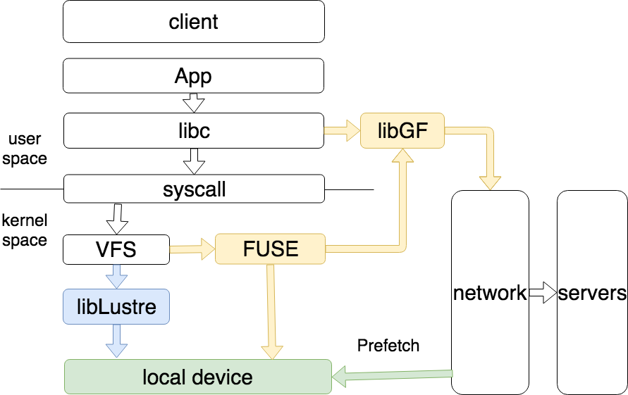

# ***Math***
$$
f(x) = \int_{-\infty}^\infty xdx
$$
## *Links* 
[a link]:[## Images]
visit [bing](bing.com) to check more details.

## ***Lists***
* when
    * todaty
    * tomorrow
    * next week
* what
* how
* who

## ***Images***

## ***Code Blocks***
    #include <iostream.h>  
    int main()  
    {  
        if(true)  
            do sth;
    }